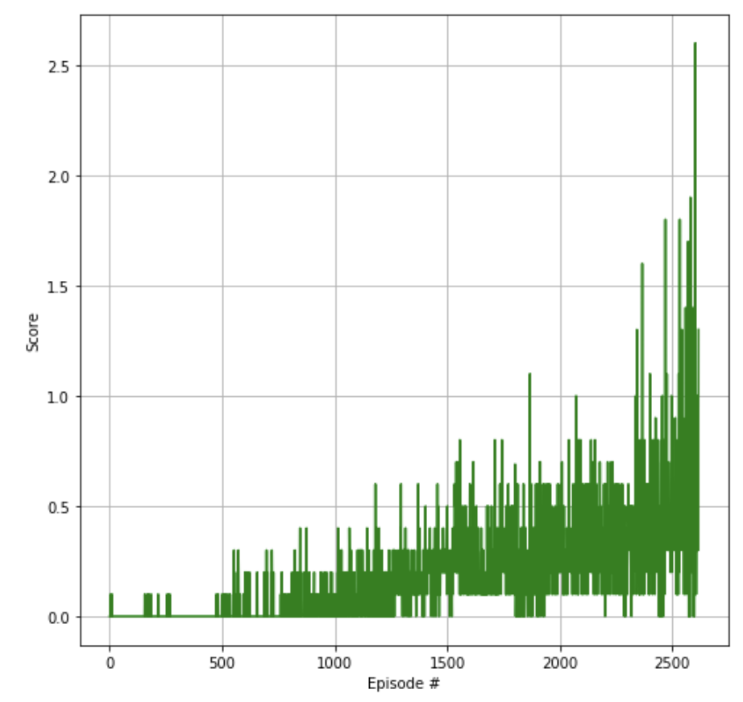

{
 "cells": [
  {
   "cell_type": "markdown",
   "metadata": {},
   "source": [
    "# Summary\n",
    "\n",
    "In this project I implemeted and trained two RL agents to play tennis. \n",
    "If an agent hits the ball over the net, it receives a reward of +0.1. If an agent lets a ball hit the ground or hits the ball out of bounds, it receives a reward of -0.01. Thus, the goal of each agent is to keep the ball in play and get as many rewards as possible.\n",
    "\n",
    "# Implementation \n",
    "## Algorithm\n",
    "This project utilised the `DDPG` (Deep Deterministic Policy Gradient) architecture outlined in the \n",
    "[DDPG-Bipedal Udacity project repo](https://github.com/udacity/deep-reinforcement-learning/tree/master/ddpg-bipedal).\n",
    "\n",
    "The extended `DDPG` algorithm `MADDPG` is implemented in the [maddpg.py](maddpg.py) file. Learning of continuous actions requires an actor and a \n",
    "critic model. The models for `Actor` and `Critic` are implemented in the [networks.py](networks.py).\n",
    "\n",
    "The agents were trained using shared actor and critic networks, as well as a shared replay buffer.\n",
    "The actor model learns to predict an action vector while the critic model \n",
    "learns Q values for state-action pairs. The Replay Buffer is implemented in the [replay_buffer.py](replay_buffer.py).\n",
    "It also distinguishes between online and target models for both actor and critic, similar to \n",
    "fixed Q-targets and double DQN technique. Online models are updated by minimizing loses while target models are updated\n",
    "through soft update, i.e. online model parameters values are partially transferred to target models. This helps to avoid \n",
    "overestimation of Q-values and makes the training more stable.\n",
    "\n",
    "The core of MADDPG algorithm is implemented in the Agent class of the [maddpg.py](maddpg.py).An important aspect is the noise added to the actions to allow exploration of the the action space. The \n",
    "noise is generated through the `Ornstein–Uhlenbeck` process, which is a stochastic process that is both Gaussian and Markov, \n",
    "drifting towards the mean in long-term. This code of `Ornstein–Uhlenbeck` process can be found n the [noise.py](noise.py). The noise was added only in the first 300 episodes.\n",
    "\n",
    "\n",
    "## Architectures\n",
    "\n",
    "### Actor Network \n",
    "\n",
    "1. State input (33 units * 2)\n",
    "2. Hidden layer (256 units) with ReLU activation and batch normalization\n",
    "3. Hidden layer (256 units) with ReLU activation and batch normalization\n",
    "4. Action output (4 units) with tanh activation\n",
    "\n",
    "### Critic Network \n",
    "\n",
    "1. State input (33 units * 2)\n",
    "2. Hidden layer (256 nodes) with ReLU activation and batch normalization\n",
    "3. Action input (4 units)\n",
    "4. Hidden layer with inputs from layers 2 and 3 (128 nodes) with ReLU activation and batch normalization\n",
    "5. Q-value output (1 node)\n",
    "\n",
    "### Hyperparameters\n",
    "\n",
    "Almost all the hyperparameters are defined in the [constants.py](constants.py):\n",
    "\n",
    " Hyperparameter | Value | Description |\n",
    "|---|---:|---|\n",
    "| Replay buffer size | 1e6 | Maximum size of experience replay buffer |\n",
    "| Replay batch size | 256 | Number of experiences sampled in one batch |\n",
    "| Actor hidden units | 256, 256 | Number of units in hidden layers of the actor model |\n",
    "| Critic hidden units | 256, 256 | Number of units in hidden layers of the critic model |\n",
    "| Actor learning rate | 1e-3 | Controls parameters update of the online actor model |\n",
    "| Critic learning rate | 1e-3 | Controls parameters update of the online critic model |\n",
    "| Target update mix | 1e-3 | Controls parameters update of the target actor and critic models |\n",
    "| Update every N steps | 10 | The target model will be soft update every N steps.\n",
    "| Discount factor | 0.99 | Discount rate for future rewards |\n",
    "| Ornstein-Uhlenbeck, mu | 0 | Mean of the stochastic  process|\n",
    "| Ornstein-Uhlenbeck, theta | 0.15 | Parameter of the stochastic process |\n",
    "| Ornstein-Uhlenbeck, sigma | 0.2 | Standard deviation of the stochastic process |\n",
    "| print every | 200 | How often to print average score during training |\n",
    "| consecutive episodes | 100 | How many episodes at least SOLVED_SCORE must be achieved to solve the RL task\n",
    "| solved score | 0.5 | Average score needed to solve the RL task |\n",
    "| stop noise after episode | 300 | Stop adding noise after defined number of periods |\n",
    "| Max episodes | 8000 | Maximum number of episodes to train |\n",
    "| Max steps | 1e3 | Maximum number of timesteps per episode |\n",
    "\n",
    "\n",
    "## Results\n",
    "\n",
    "\n",
    "\n",
    "```\n",
    "Episode 200\tAverage Score: 0.01 best_score 0.20000000298023224\n",
    "Episode 400\tAverage Score: 0.02 best_score 0.60000000894069676\n",
    "Episode 600\tAverage Score: 0.05 best_score 0.6000000089406967\n",
    "Episode 800\tAverage Score: 0.06 best_score 0.6000000089406967\n",
    "Episode 1000\tAverage Score: 0.10 best_score 0.7000000104308128\n",
    "Episode 1200\tAverage Score: 0.27 best_score 2.2000000327825546\n",
    "Episode 1271\tAverage Score: 0.50 best_score 5.2000000774860386\n",
    "Environment solved in 1271 episodes!\tAverage Score: 0.50\n",
    "\n",
    "Total time took for training: 8.693374188741048 min.\n",
    "\n",
    "```\n",
    "## Possible extensions\n",
    "\n",
    "- [Prioritized Experience Replay](https://arxiv.org/abs/1511.05952)\n",
    "- [Asynchronous Actor Critic](https://medium.com/emergent-future/simple-reinforcement-learning-with-tensorflow-part-8-asynchronous-actor-critic-agents-a3c-c88f72a5e9f2)"
   ]
  },
  {
   "cell_type": "code",
   "execution_count": null,
   "metadata": {},
   "outputs": [],
   "source": []
  }
 ],
 "metadata": {
  "kernelspec": {
   "display_name": "Python 3",
   "language": "python",
   "name": "python3"
  }
 },
 "nbformat": 4,
 "nbformat_minor": 2
}
